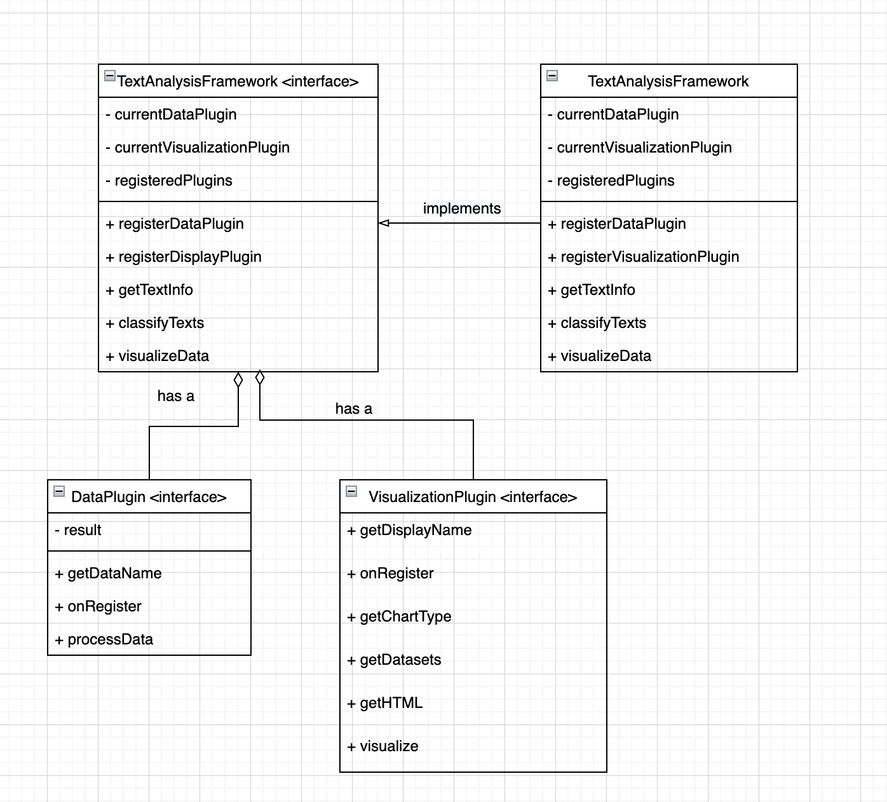

# hw6-analytics-framework-mickeymiaomiao-house
hw6-analytics-framework-mickeymiaomiao-house created by GitHub Classroom

## Milestone C
Plugin implementations for framework from Team Anonymous-Team-Public. Please refer to branch ***pluginWorkHere***. And navigate to **"hw6-anonymous-team-public/"**.
### How to start
<p>Back End: navigate to “/backend” directory and running “mvn clean install” to install the dependencies, then run “mvn exec:exec” in the terminal to launch the backend server. </p>
<p>Front End: navigate to “/visualization” directory and running “npm install --force” to install the dependencies, then run “npm start” command in the terminal. Note "--force" is necessary here to enable wordcloud package for visualization. </p>

### Data Plugins we extend
<p>Data plugins we added include DOCXPlugin.java, RTFPlugin.java and TXTPlugin.java files, so that users can upload resumes of docx, rtf and txt formats. Test files of these formats can be found under "hw6-anonymous-team-public/backend/src/test/resources/" this directory. </p>
<p>Specifically, test.docx to test DOCXPlugin, test.rtf to test RTFPlugin, testForTXT.txt to test TXTPlugin. </p>
<p>testForJSON.txt is meant for testing JSONPlugin. </p>

### Visualization Plugins we extend
<p>Visualization plugins we added include ContactInfoPlugin.tsx and WordCloudPlugin.tsx files, so that users can display their contact information in a more direct way and view their word frequency more intuitively by dynamic wordcloud chart. High frequency word will display with a larger font size. </p>

### Experience report
Please refer to experience_report.md under "hw6-anonymous-team-public/".

## Milestone A&B 

### Introduction
The TextAnalysis Framework is used to process text data. It generates visualization of topic frequencies of the text data given.
Users can pass their own data plugins to our framework, and our framework will use Google NLP API(https://cloud.google.com/natural-language/docs) to generate a topic for each input text.

(Topic list for V2 Google NLP model is in the below link: https://cloud.google.com/natural-language/docs/categories#categories_version_2)

Sample data plugins include NYTimes Most Popular API(https://developer.nytimes.com/docs/most-popular-product/1/overview), Wikipedia Daily Feed API(https://en.wikipedia.org/api/rest_v1/#/Page%20content) and Guardian API(https://open-platform.theguardian.com/documentation/search).

- For NYTimes, the API will extract 20 posts randomly from past 7 days' posts and get their abstract parts.
- For Wikipedia, the API will extract daily feeds of past 7 days and get their abstract parts.
- For Guardian, the API will extract daily feeds of past 7 days and get their web titles.

### Work plan
Basically we each will complete a separate part of this framework and together work out GUI and interaction with backend and frontend. Olivia will be responsible for implementing multiple data fetch plugins. 
Terry will be working on framework implementation and Teresa will be working on various visualization plugins. 
Then we will together work on implementation of GUI. 

Timeline for this project will be: Nov 22nd as checkpoint for our individual work and Nov 25th as final checkpoint for our whole project. 
Then we will use the rest of time to modify and finalize our project.

### Set Credentail Environment !!!【VERY IMPORTANT】!!!
EVERY TIME BEFORE YOU RUN mvn exec:exec, please DO set environment for framework first. Download environment.json file and store it on your computer.
In your command line, type
```
export GOOGLE_APPLICATION_CREDENTIALS="path_to_environment.json"
```
environment.json is provided in the root directory.

### Set Up Backend Server ##
Either run the Java backend by using your IDE or by typing 

```
mvn exec:exec
```
in the backend folder. This will start the Java server at http://localhost:8080.

### Set Up Frontend Server ##
In the frontend folder, run

```
npm install
npm start
```

This will start the frontend server at http://localhost:3000. You can update the frontend code as the server is running in the development mode (i.e., npm start). It will automatically recompile and reload.

### How to Use 
Pick a Data Plugin first, and then pick a Display Plugin.
Click "Click Me To See Graph" to see the visualization result. It might take a few seconds for the graph to show up. Refresh if you cannot see the graph after some time.

### Extend Framework 
Please refer to diagram below.




### Data Plugin
Implements the DataPlugin interface in the backend. Add your plugin class name in /backend/src/main/resources/META-INF/services/edu.cmu.cs.cs214.rec09.framework.core.DataPlugin.

### Display Plugin
Implements the DisplayPlugin interface in the backend. Add your plugin class name in /backend/src/main/resources/META-INF/services/edu.cmu.cs.cs214.rec09.framework.core.DisplayPlugin.

### Data Processing
The framework utilizes the Google Cloud Natural Language API. It classifies and returns the most likely topics of a text. We take the topic result with the highest probabilities and count the frequency of each topic showing up.
