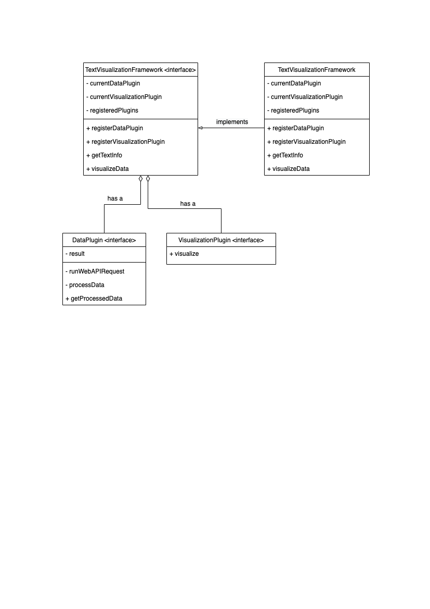
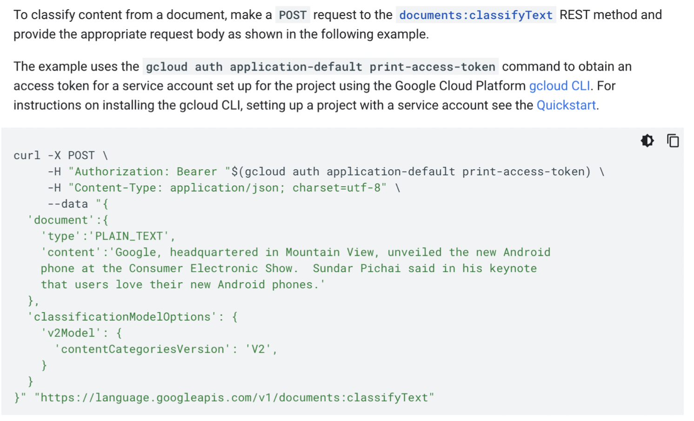

# Framework Final Project – Design 

## 1. Domain: 
- Describe your framework domain, with examples of possible plugins your framework could support. This could be about half a page, similar to the description in Appendix A.

We plan to perform text classification and entity analysis on different documents from wikipedia pages, New York Times articles, and Guardian API. This framework will extract documents of the past 7 days extracted from various sources, process these texts, analyze results, and display results using visualization tools. 
Reuse of framework: Our framework does text classification and entity analysis and transforms results to data for visualization. Existing visualization could also be used when a new data plugin is added. 

We use google nlp API(https://cloud.google.com/natural-language/docs) to analyze text and return a list of content categories as well as information about entities(proper nouns such as public figures, landmarks, etc.) that apply to the text. 
Data plugins provide text documents and corresponding time stamps, including
- NewYork Times Article Plugin extracts most popular articles between specific dates in New York Times using Most Popular API.
https://developer.nytimes.com/docs/most-popular-product/1/overview
- Wikipedia Plugin extracts abstract content of certain wikipedia feeds between specific dates using Wiki API.
https://en.wikipedia.org/api/rest_v1/#/Page%20content
- Guardian Article Plugin fetches news articles between specific dates with their titles using Guardian API.
https://open-platform.theguardian.com/documentation/search
Our framework will process text fragments and time stamps we get from data plugins, generate a topic list and perform entity analysis. This output will then be input to visualization plugins.
Visualization plugins include: 
- Various time-series charts displaying popular topics/entities over time.
- Word cloud containing high frequency entities under certain topics.

## 2. Generality vs specificity: 
- Describe your decisions about the generality and specificity of your framework (i.e., domain engineering): your key abstractions, the reusable functionality your framework provides, and the potential flexibility of plugins. This might be about 1 page.

Framework: interface
FrameworkImpl: implements GameFramework
Methods:
- registerDataPlugin
- registerVisualizationPlugin
- getTextInfo
- visualizeData
- getters

There will be a TextVisualizationFramework interface and a TextVisualizationFrameworkImpl (implementation class) class that implements the interface. The framework can only be applied to the plugins that we implemented, so a registerDataPlugin and a registerVisualizationPlugin method will be implemented in the implementation class. A new plugin needs to be registered using this method. For each visualization, a specific data plugin and a visualization are used. The setDataPlugin and setVisualizationPlugin methods will be called to set the plugins.

For extensibility and flexibility of plugins, part of the data processing should be implemented in the plugin class since text information from different data APIs may have different forms. A getTextInfo method will be implemented in the implementation class, and will call getProcessedData method from the data plugin. The processText method in the data plugin class will fetch text data from a data API and transform the results into an array of Text type, which contains a text of type String and a publishing date of type String. The visualizeData method in the framework will be implemented for visualization. It will first use the NLP API to do text classification. The result will then be passed by the framework into the visualize method in the data visualization plugin. The value returned from NLP API should have all the possible values required for visualization.

Reusable functionality: NLP API data processing

## 3. Project structure: 
- Describe your overall project structure: the organization of the framework and plugins into packages or projects, the location of plugin interfaces and key data structures, and how plugins are loaded. This will help us navigate your project later and will likely require less than half a page.

Overall, we decided to mimic the project structure of the TicTacToe game framework in recitation 9. We will decouple the backend and frontend. In the backend folder, we will have a framework subfolder for framework interface and implementation, plugin interface, and also state classes for communicating data to GUI. Plugins will be in a separate folder called plugin and main logic and server located in App.java. Apart from that, everything for the frontend such as CSS, React.js framework and HTML structure file are located in a separate folder called frontend. Plugins will be loaded in App.java using service loader and be registered into the framework using observer pattern so that all of them can make responses when an event happens.

## 4. Plugin interfaces: 
- Describe your plugin interfaces (code snippets or API documentation), including key methods and the data structures exchanged between plugins and the framework. Feel free to include or link to diagrams. This may require multiple pages, depending on the size of your APIs. 

Data Plugins:
- - runWebAPIRequest()
- - processData()
- + getProcessedData()

Visualization Plugins:
- + visualize()

NLP classifying text API: https://cloud.google.com/natural-language/docs/classifying-text

The API requires an input of String content for classification. The processData method in the data plugin should therefore return an array of Text type, which contains a String type that represents the content of the text, and a String type that indicates the timestamps of the publication of the text. We will be looking at the topics of all the texts in the array at the same time.

The output of the API fetch is a ClassificationCategory list which contains the names of possible topics and the respective confidence for each topic. We will extract the most possible topic from the list, which should be contained in the first ClassificationCategory object. The visualize method in framework will iterate through the whole array of Text type, and send them each through the NLP API, completing the process explained above. The frequency of each topic would be calculated. All these information (topics, topic frequencies, publication time of the topics) would be passed into the visualization plugin. The visualize method from the visualization plugin will be called and visualize based on the frequency of the topics and publication time of the texts. 
